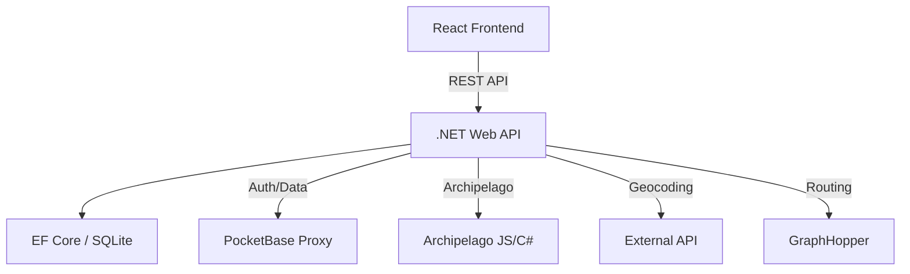

# Bikeapelago Migration Architecture

This document describes the architectural decisions and design patterns chosen for the React/.NET migration.

## High-Level Diagram

## Frontend: React + Zustand

The frontend is a single-page application (SPA) built with Vite and React. State management is handled through Zustand, separated into logical stores:
- `userStore`: Manages authentication state and profile information.
- `gameStore`: Manages current session data, Archipelago state, and location tracking.
- `mapStore`: Manages Leaflet map state, routing parameters, and active waypoints.

### Styling
The UI uses **Tailwind CSS** with **DaisyUI** as the component layer to maintain aesthetic consistency with the original Svelte version.

## Backend: .NET 8 Web API

The backend is built using ASP.NET Core 8.0, following clean architecture principles:
- **Controllers**: Entry points for HTTP requests.
- **Services**: Business logic, including geocoding logic, session validation, and Archipelago item processing.
- **Data Access**: Entity Framework Core with SQLite for local persistence (mapping to `GameSessions`, `Locations`, etc.).

### Authentication
JWT-based authentication is used to provide stateless security between the React frontend and .NET backend. A custom `IdentityService` manages user registration and login.

## Feature Mapping (Svelte -> React/.NET)

| Original Svelte Feature | New React/.NET Implementation |
| :---------------------- | :--------------------------- |
| `+layout.svelte`        | `Layout.tsx` (Component)      |
| `+page.svelte` (Home)   | `Home.tsx` (Page Component)   |
| `/game/[id]/` (Map)     | `GameView.tsx` + `MapCore`    |
| `pb` (PocketBase SDK)   | `apiService` + .NET Backend   |
| `$lib/ap.ts`            | `ArchipelagoService` (.NET)  |

## Deployment Strategy

The migration supports a containerized deployment:
1.  **Backend Container**: Runs the .NET application.
2.  **Frontend Build**: Static files served by Nginx or the .NET host.
3.  **Database**: Mounted SQLite volume or connection to a managed Postgres instance.
