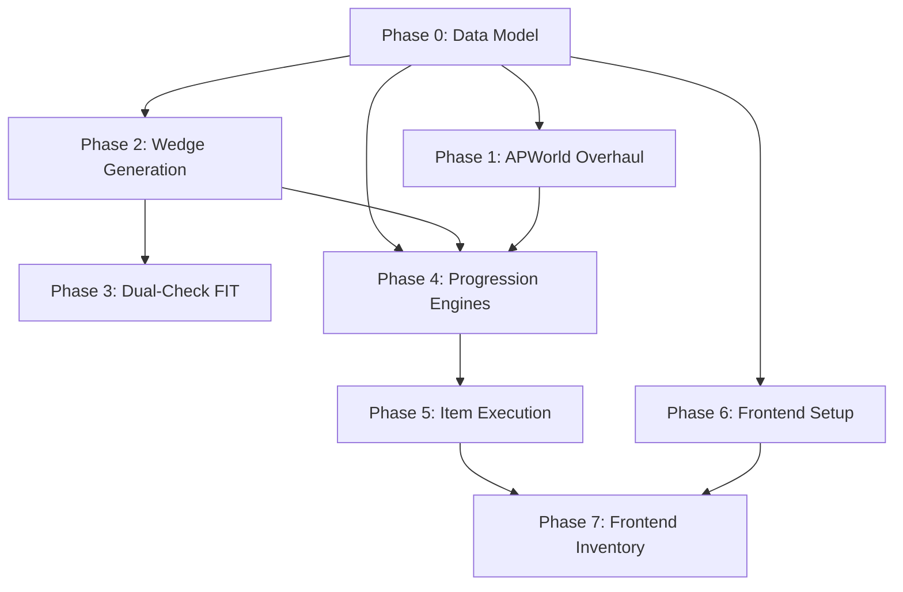

# Bikeapelago: Implementation Plan — From Current State to Vision

## Executive Summary

The [design document](file:///Volumes/1TB/Repos/avarts/bikeapelago-react/Bikeapelago_%20Implementation%20Plan.md) describes a rich item/progression system with three game modes, dual-check nodes, useful items, and PostGIS-powered spatial generation. The **current codebase** implements a simpler system that works end-to-end but lacks almost all of these features. This plan bridges the gap.

---

## Gap Analysis: Plan vs. Reality

| Feature | Design Doc | Current Codebase | Gap |
|---|---|---|---|
| **Checks per Node** | 2 (Arrival + Precision) | 1 (`ApLocationId` per node) | 🔴 Major |
| **Progression Modes** | 3 (Quadrant, Radius, Free) | 2 (singleplayer = linear unlock, archipelago = 1:1 item↔node) | 🔴 Major |
| **APWorld Items** | Passes, Progressive Radius, Node Reveals, Detour, Drone, Signal Amplifier, Fillers | Node Unlock 1–N, Location Swap, Wheel Patch Kit, Victory | 🔴 Major |
| **APWorld Regions** | Hub + 4 Quadrant zones with Pass access rules | Menu → Map (flat) | 🔴 Major |
| **Node Generation** | Wedge-partitioned (Hub 25% radius, 4 quadrants) with `RegionTag` | Uniform random from PostGIS within radius, density bias | 🟡 Medium |
| **Useful Items Backend** | `ItemExecutionService` for Detour (hot-swap), Drone (auto-check), Signal Amplifier (2x radius) | None | 🔴 Major |
| **Item Inventory (Frontend)** | UI to view/use Detour, Drone, Signal Amplifier | `inventory` panel exists but only shows received AP items as a list | 🟡 Medium |
| **Dual-radius .FIT check** | `MAXIMUM_RADIUS_METERS` (Arrival) + `MINIMUM_RADIUS_METERS` (Precision) | Single 30m radius in `FitAnalysisService` | 🟡 Medium |
| **Filler Items** | Fresh Air, Leg Cramp, Empty CO2, Kudos, etc. | Wheel Patch Kit only | 🟢 Minor |
| **Session `Mode` field** | 3 separate concerns: game mode, transport mode, progression type | Single `Mode` field conflates `"bike"`/`"singleplayer"` — **live bug** (see Phase 0a) | 🔴 Critical |
| **`MapNode.RegionTag`** | Hub / North / East / South / West | Not present | 🔴 Major |
| **`MapNode` dual location IDs** | `ArrivalLocationId` + `PrecisionLocationId` | Single `ApLocationId` | 🔴 Major |

---

## Resolved Architecture Decisions

| Decision | Resolution |
|---|---|
| **Dual-check** | ✅ Implement now. Arrival = 60m, Precision = 30m. |
| **APWorld breaking changes** | ✅ Accepted. Break it all at once. No migration support needed. |
| **Singleplayer progression modes** | ✅ Singleplayer supports Quadrant/Radius/Free. C# logic mirrors AP item distribution identically. |
| **Hub size** | Fixed at 25% of max radius. Not configurable. |
| **Signal Amplifier stacking** | Additive. 2× amplifiers = 3× radius (base + 1 + 1), not multiplicative. |
| **Radius constants** | Arrival = **60m**, Precision = **30m**. |

---

## Phased Implementation Plan

### Phase 0: Data Model Foundation + Mode Bug Fix
**Goal**: Fix the critical Mode field conflation bug, then extend the database models to support the full feature set.

**Estimated Effort**: 1–2 sessions

#### 0a. 🐛 Fix `Mode` Field Conflation (Critical Bug)

The `GameSession.Mode` field is currently used for **two different things** depending on the code path, and one overwrites the other:

| Where | What it writes to `Mode` | Value |
|---|---|---|
| Session creation ([SessionSetup.tsx:144](file:///Volumes/1TB/Repos/avarts/bikeapelago-react/frontend/packages/apps/bikepelago-app/src/pages/SessionSetup.tsx#L144)) | Game mode | `"archipelago"` or `"singleplayer"` |
| Node generation ([NodeGenerationService.cs:102](file:///Volumes/1TB/Repos/avarts/bikeapelago-react/api/Services/NodeGenerationService.cs#L102)) | Transport mode | `"bike"` or `"walk"` |
| `OsmDiscoveryService` ([NodeGenerationService.cs:70](file:///Volumes/1TB/Repos/avarts/bikeapelago-react/api/Services/NodeGenerationService.cs#L70)) | Transport mode | reads `request.Mode` as bike/walk |
| Progression engine ([SessionsController.cs:404](file:///Volumes/1TB/Repos/avarts/bikeapelago-react/api/Controllers/SessionsController.cs#L404)) | Game mode | `_engineFactory.CreateEngine(session.Mode)` checks for `"singleplayer"` |

**The bug**: After node generation, `session.Mode` is overwritten from `"singleplayer"` → `"bike"`, so `CreateEngine("bike")` always falls through to the Archipelago engine. **Singleplayer progression is silently broken.**

**The fix**: Split into three separate fields on `GameSession`:

| New Column | JSON Property | Purpose | Values | Default |
|---|---|---|---|---|
| `Mode` | `"mode"` | Game/connection mode | `"archipelago"` \| `"singleplayer"` | `"archipelago"` |
| `TransportMode` | `"transport_mode"` | How the player travels | `"bike"` \| `"walk"` | `"bike"` |
| `ProgressionType` | `"progression_type"` | AP progression logic *(new)* | `"quadrant"` \| `"radius"` \| `"free"` | `"free"` |

**All consumers that need updating:**

**Backend — Entity:**
- [Entities.cs:68](file:///Volumes/1TB/Repos/avarts/bikeapelago-react/api/Models/Entities.cs#L68) — Add `TransportMode` and `ProgressionType` properties, keep `Mode` but change default from `"bike"` to `"archipelago"`

**Backend — Services/Controllers writing `Mode`:**
- [NodeGenerationService.cs:102](file:///Volumes/1TB/Repos/avarts/bikeapelago-react/api/Services/NodeGenerationService.cs#L102) — `session.Mode = request.Mode` → `session.TransportMode = request.TransportMode`
- [NodeGenerationService.cs:70](file:///Volumes/1TB/Repos/avarts/bikeapelago-react/api/Services/NodeGenerationService.cs#L70) — `request.Mode` passed to OSM discovery → rename to `request.TransportMode`
- [NodeGenerationRequest](file:///Volumes/1TB/Repos/avarts/bikeapelago-react/api/Services/NodeGenerationService.cs#L19) — `Mode` property (line 19) → rename to `TransportMode`, keep `GameMode` (line 20) as-is

**Backend — Services/Controllers reading `Mode`:**
- [SessionsController.cs:404](file:///Volumes/1TB/Repos/avarts/bikeapelago-react/api/Controllers/SessionsController.cs#L404) — `_engineFactory.CreateEngine(session.Mode)` — no change needed once `Mode` default is fixed to `"archipelago"`
- [ProgressionEngineFactory](file:///Volumes/1TB/Repos/avarts/bikeapelago-react/api/Services/ProgressionEngines.cs#L103) — `gameMode == "singleplayer"` — no change needed

**Frontend — Session creation payload:**
- [SessionSetup.tsx:136-145](file:///Volumes/1TB/Repos/avarts/bikeapelago-react/frontend/packages/apps/bikepelago-app/src/pages/SessionSetup.tsx#L136-L145) — `mode: mode` is correct (sends `"archipelago"`/`"singleplayer"`)
- [SessionSetup.tsx:183-189](file:///Volumes/1TB/Repos/avarts/bikeapelago-react/frontend/packages/apps/bikepelago-app/src/pages/SessionSetup.tsx#L183-L189) — Generate call sends `mode: travelMode` → rename to `transportMode: travelMode`

**Frontend — Types:**
- [operations/sessions/types.ts:17](file:///Volumes/1TB/Repos/avarts/bikeapelago-react/frontend/packages/apps/bikepelago-app/src/operations/sessions/types.ts#L17) — `mode: string` → keep, add `transport_mode?: string`
- [types/game.ts](file:///Volumes/1TB/Repos/avarts/bikeapelago-react/frontend/packages/apps/bikepelago-app/src/types/game.ts#L12-L22) — Add `transport_mode`, `progression_type` to `GameSession` interface

#### 0b. Extend `GameSession` Entity (New Columns)
[Entities.cs](file:///Volumes/1TB/Repos/avarts/bikeapelago-react/api/Models/Entities.cs#L36-L95)

```diff
 public class GameSession
 {
     [JsonPropertyName("mode")]
-    public string Mode { get; set; } = "bike";
+    public string Mode { get; set; } = "archipelago";
+    // "archipelago" | "singleplayer"
+
+    [JsonPropertyName("transport_mode")]
+    public string TransportMode { get; set; } = "bike";
+    // "bike" | "walk"
+
+    [JsonPropertyName("progression_type")]
+    public string ProgressionType { get; set; } = "free";
+    // "quadrant" | "radius" | "free"
+
+    [JsonPropertyName("max_radius_meters")]
+    public double? MaxRadiusMeters { get; set; }
+
+    [JsonPropertyName("current_radius_percentage")]
+    public int CurrentRadiusPercentage { get; set; } = 25;
+    // Tracks progressive radius unlocks: 25 → 50 → 75 → 100
 }
```

#### 0c. Extend `MapNode` Entity
[Entities.cs](file:///Volumes/1TB/Repos/avarts/bikeapelago-react/api/Models/Entities.cs#L97-L137)

```diff
 public class MapNode
 {
+    [JsonPropertyName("region_tag")]
+    public string RegionTag { get; set; } = "Hub";
+    // "Hub" | "North" | "East" | "South" | "West"
+
+    [JsonPropertyName("arrival_location_id")]
+    public long ArrivalLocationId { get; set; }
+
+    [JsonPropertyName("precision_location_id")]
+    public long? PrecisionLocationId { get; set; }
+    // Null for single-check mode
+
+    [JsonPropertyName("arrival_checked")]
+    public bool ArrivalChecked { get; set; } = false;
+
+    [JsonPropertyName("precision_checked")]
+    public bool PrecisionChecked { get; set; } = false;
+
+    [JsonPropertyName("has_been_relocated")]
+    public bool HasBeenRelocated { get; set; } = false;
+
     [JsonPropertyName("ap_location_id")]
     public long ApLocationId { get; set; }
+    // Kept for backwards compat; semantically = ArrivalLocationId
 }
```

#### 0d. Create `PlayerItem` Entity (New)
```csharp
public class PlayerItem
{
    [Key]
    public Guid Id { get; set; } = Guid.NewGuid();
    public Guid SessionId { get; set; }
    public string ItemName { get; set; } = string.Empty;
    // "Detour" | "Drone" | "Signal Amplifier" | filler names
    public long ApItemId { get; set; }
    public bool IsUsed { get; set; } = false;
    public DateTime ReceivedAt { get; set; } = DateTime.UtcNow;
    public DateTime? UsedAt { get; set; }
}
```

#### 0e. DB Migration
- Create EF Core migration for all of the above (0a–0d)
- **✅ Pre-approved** to run `dotnet ef database update` on the `bikeapelago` game database
- **⛔ NEVER touch the `osm_discovery` database** — no migrations, no writes, no schema changes

**Files to modify:**
- [Entities.cs](file:///Volumes/1TB/Repos/avarts/bikeapelago-react/api/Models/Entities.cs) — `GameSession` + `MapNode` + new `PlayerItem`
- [BikeapelagoDbContext](file:///Volumes/1TB/Repos/avarts/bikeapelago-react/api/Data) — add `DbSet<PlayerItem>`
- [NodeGenerationService.cs](file:///Volumes/1TB/Repos/avarts/bikeapelago-react/api/Services/NodeGenerationService.cs) — `Mode` → `TransportMode` rename
- [SessionsController.cs](file:///Volumes/1TB/Repos/avarts/bikeapelago-react/api/Controllers/SessionsController.cs) — verify `CreateEngine(session.Mode)` still correct
- [SessionSetup.tsx](file:///Volumes/1TB/Repos/avarts/bikeapelago-react/frontend/packages/apps/bikepelago-app/src/pages/SessionSetup.tsx) — fix generate payload
- [operations/sessions/types.ts](file:///Volumes/1TB/Repos/avarts/bikeapelago-react/frontend/packages/apps/bikepelago-app/src/operations/sessions/types.ts) — add `transport_mode`
- [types/game.ts](file:///Volumes/1TB/Repos/avarts/bikeapelago-react/frontend/packages/apps/bikepelago-app/src/types/game.ts) — add new fields to interfaces

**Acceptance Criteria:**
- [ ] `dotnet build` succeeds
- [ ] `session.Mode` is never overwritten by transport mode after node generation
- [ ] `CreateEngine(session.Mode)` correctly returns `SinglePlayerProgressionEngine` for singleplayer sessions
- [ ] Migration generated, reviewed, and applied
- [ ] Existing sessions/nodes still load correctly

---

### Phase 1: APWorld Overhaul
**Goal**: Rewrite the Python APWorld to support the three progression modes and all item types.

**Estimated Effort**: 2–3 sessions

**Dependency**: Phase 0 (data model must be settled first)

#### 1a. New Options
[options.py](file:///Volumes/1TB/Repos/avarts/bikeapelago-react/frontend/packages/apps/bikepelago-app/apworld/bikeapelago/options.py)

Replace the entire file:
```python
import typing
from dataclasses import dataclass

from Options import Choice, Range, Toggle, PerGameCommonOptions


class CheckCount(Range):
    """The number of intersections/locations to generate for this world."""
    display_name = "Check Count"
    range_start = 10
    range_end = 1000
    default = 100


class GoalType(Choice):
    """The goal required to complete the game."""
    display_name = "Goal"
    option_all_intersections = 0
    option_percentage = 1
    default = 0


class StartingNodes(Range):
    """The number of Node Reveal items placed into the player's starting inventory.
    These nodes are immediately available at the start of the game.
    Only applies to Free progression mode."""
    display_name = "Starting Nodes"
    range_start = 1
    range_end = 50
    default = 3


class ProgressionMode(Choice):
    """The progression mode for this world.
    Quadrant: Unlock 4 geographic zones via Pass items.
    Radius: Progressively expand the playable area from the center.
    Free: Reveal individual nodes one-by-one (classic mode)."""
    display_name = "Progression Mode"
    option_quadrant = 0
    option_radius = 1
    option_free = 2
    default = 0


class DualCheck(Toggle):
    """Enable dual-check nodes (Arrival + Precision).
    When enabled, each node has two location checks:
    - Arrival (60m radius, amplifiable by Signal Amplifier)
    - Precision (30m radius, fixed)
    Doubles the total location count."""
    display_name = "Dual Check"
    default = True


@dataclass
class BikeapelagoOptions(PerGameCommonOptions):
    check_count: CheckCount
    goal_type: GoalType
    starting_nodes: StartingNodes
    progression_mode: ProgressionMode
    dual_check: DualCheck


bikeapelago_options: typing.Dict[str, type] = {
    "check_count": CheckCount,
    "goal_type": GoalType,
    "starting_nodes": StartingNodes,
    "progression_mode": ProgressionMode,
    "dual_check": DualCheck,
}
```

#### 1b. New Items
[items.py](file:///Volumes/1TB/Repos/avarts/bikeapelago-react/frontend/packages/apps/bikepelago-app/apworld/bikeapelago/items.py)

Replace the entire file:
```python
from typing import Dict, NamedTuple

from BaseClasses import Item, ItemClassification


class ItemData(NamedTuple):
    code: int
    classification: ItemClassification


class BikeapelagoItem(Item):
    game: str = "Bikeapelago"


MAX_CHECKS = 2000
START_ID = 800000

# --- ID Layout ---
# 800001 .. 802000  = Node Reveal 1..2000 (Free mode progression)
# 802001             = Victory
# 802002             = North Quadrant Pass
# 802003             = South Quadrant Pass
# 802004             = East Quadrant Pass
# 802005             = West Quadrant Pass
# 802006 .. 802008   = Progressive Radius Increase (x3)
# 802010             = Detour
# 802011             = Drone
# 802012             = Signal Amplifier
# 802020 .. 802025   = Fillers

VICTORY_ID          = START_ID + MAX_CHECKS + 1
NORTH_PASS_ID       = START_ID + MAX_CHECKS + 2
SOUTH_PASS_ID       = START_ID + MAX_CHECKS + 3
EAST_PASS_ID        = START_ID + MAX_CHECKS + 4
WEST_PASS_ID        = START_ID + MAX_CHECKS + 5
RADIUS_INCREASE_ID  = START_ID + MAX_CHECKS + 6  # 3 copies share this ID
DETOUR_ID           = START_ID + MAX_CHECKS + 10
DRONE_ID            = START_ID + MAX_CHECKS + 11
SIGNAL_AMP_ID       = START_ID + MAX_CHECKS + 12

FILLER_BASE_ID      = START_ID + MAX_CHECKS + 20

# --- Item Table ---
item_table: Dict[str, ItemData] = {
    # Progression: Node Reveals (Free mode — 1:1 node unlock)
    **{f"Node Reveal {i}": ItemData(START_ID + i, ItemClassification.progression)
       for i in range(1, MAX_CHECKS + 1)},

    # Progression: Quadrant Passes (Quadrant mode — unlock geographic zones)
    "North Quadrant Pass": ItemData(NORTH_PASS_ID, ItemClassification.progression),
    "South Quadrant Pass": ItemData(SOUTH_PASS_ID, ItemClassification.progression),
    "East Quadrant Pass":  ItemData(EAST_PASS_ID,  ItemClassification.progression),
    "West Quadrant Pass":  ItemData(WEST_PASS_ID,  ItemClassification.progression),

    # Progression: Radius Increases (Radius mode — expand playable area)
    "Progressive Radius Increase": ItemData(RADIUS_INCREASE_ID, ItemClassification.progression),

    # Victory
    "Victory": ItemData(VICTORY_ID, ItemClassification.progression),

    # Useful: Consumable items
    "Detour":           ItemData(DETOUR_ID,     ItemClassification.useful),
    "Drone":            ItemData(DRONE_ID,      ItemClassification.useful),
    "Signal Amplifier": ItemData(SIGNAL_AMP_ID, ItemClassification.useful),

    # Filler
    "Fresh Air":                ItemData(FILLER_BASE_ID,     ItemClassification.filler),
    "Leg Cramp":                ItemData(FILLER_BASE_ID + 1, ItemClassification.trap),
    "Empty CO2 Cartridge":      ItemData(FILLER_BASE_ID + 2, ItemClassification.filler),
    "Kudos":                    ItemData(FILLER_BASE_ID + 3, ItemClassification.filler),
    "Sense of Accomplishment":  ItemData(FILLER_BASE_ID + 4, ItemClassification.filler),
    "Sunburn":                  ItemData(FILLER_BASE_ID + 5, ItemClassification.trap),
}

USEFUL_RATIO = 0.2  # ~20% of location count goes to useful items
FILLER_NAMES = ["Fresh Air", "Empty CO2 Cartridge", "Kudos", "Sense of Accomplishment"]
TRAP_NAMES = ["Leg Cramp", "Sunburn"]

# Item name groups for set_rules has_group() calls
ITEM_GROUPS = {
    "Node Reveal":     {f"Node Reveal {i}" for i in range(1, MAX_CHECKS + 1)},
    "Quadrant Pass":   {"North Quadrant Pass", "South Quadrant Pass",
                        "East Quadrant Pass", "West Quadrant Pass"},
    "Useful":          {"Detour", "Drone", "Signal Amplifier"},
}
```

#### 1c. New Regions & create_items (Quadrant Mode)
[__init__.py](file:///Volumes/1TB/Repos/avarts/bikeapelago-react/frontend/packages/apps/bikepelago-app/apworld/bikeapelago/__init__.py)

Full rewrite:
```python
from BaseClasses import Region, LocationProgressType
from worlds.AutoWorld import WebWorld, World
from worlds.generic.Rules import set_rule

from .items import (
    BikeapelagoItem, item_table, MAX_CHECKS, ITEM_GROUPS,
    USEFUL_RATIO, FILLER_NAMES, TRAP_NAMES,
    NORTH_PASS_ID, SOUTH_PASS_ID, EAST_PASS_ID, WEST_PASS_ID,
)
from .locations import BikeapelagoLocation, location_table
from .options import BikeapelagoOptions


class BikeapelagoWeb(WebWorld):
    theme = "ocean"
    # ... (setup guide unchanged)


class BikeapelagoWorld(World):
    """
    Bikeapelago: real-world cycling intersections as Archipelago Locations.
    Supports three progression modes: Quadrant, Radius, and Free.
    """
    game = "Bikeapelago"
    web = BikeapelagoWeb()

    item_name_to_id = {
        name: data.code for name, data in item_table.items()
        if data.code is not None and name != "Victory"
    }
    location_name_to_id = {
        name: data.code for name, data in location_table.items()
        if data.code is not None
    }
    item_name_groups = ITEM_GROUPS
    options_dataclass = BikeapelagoOptions

    def create_items(self) -> None:
        check_count = self.options.check_count.value
        starting_nodes = self.options.starting_nodes.value
        dual_check = self.options.dual_check.value
        mode = self.options.progression_mode.value

        # Total locations = arrival checks + precision checks (if dual)
        total_locations = check_count * (2 if dual_check else 1)

        # Calculate useful item count (~20% of locations)
        num_useful = int(total_locations * USEFUL_RATIO)
        # Split useful evenly across Detour/Drone/Signal Amplifier
        detour_count = num_useful // 3
        drone_count = num_useful // 3
        amp_count = num_useful - detour_count - drone_count

        pool = []

        # --- Progression items (mode-dependent) ---
        if mode == 0:  # Quadrant
            pool.append(self.create_item("North Quadrant Pass"))
            pool.append(self.create_item("South Quadrant Pass"))
            pool.append(self.create_item("East Quadrant Pass"))
            pool.append(self.create_item("West Quadrant Pass"))
            progression_count = 4
        elif mode == 1:  # Radius
            for _ in range(3):
                pool.append(self.create_item("Progressive Radius Increase"))
            progression_count = 3
        else:  # Free
            for i in range(starting_nodes + 1, check_count + 1):
                pool.append(self.create_item(f"Node Reveal {i}"))
            progression_count = check_count - starting_nodes

        # Pre-collect starting node reveals (Free mode only)
        if mode == 2:  # Free
            for i in range(1, starting_nodes + 1):
                self.multiworld.push_precollected(self.create_item(f"Node Reveal {i}"))

        # --- Useful items ---
        for _ in range(detour_count):
            pool.append(self.create_item("Detour"))
        for _ in range(drone_count):
            pool.append(self.create_item("Drone"))
        for _ in range(amp_count):
            pool.append(self.create_item("Signal Amplifier"))

        # --- Filler to balance ---
        filler_needed = total_locations - len(pool) - (starting_nodes if mode == 2 else 0)
        filler_all = FILLER_NAMES + TRAP_NAMES
        for i in range(filler_needed):
            name = filler_all[i % len(filler_all)]
            pool.append(self.create_item(name))

        self.multiworld.itempool.extend(pool)

    def create_regions(self) -> None:
        check_count = self.options.check_count.value
        dual_check = self.options.dual_check.value
        mode = self.options.progression_mode.value

        menu_region = Region("Menu", self.player, self.multiworld)
        self.multiworld.regions.append(menu_region)

        hub_region = Region("Hub", self.player, self.multiworld)
        menu_region.connect(hub_region)
        self.multiworld.regions.append(hub_region)

        # Hub nodes: first 20% of check_count
        hub_count = max(1, check_count // 5)
        quadrant_count = check_count - hub_count
        per_quadrant = quadrant_count // 4

        # Hub arrival locations
        for i in range(1, hub_count + 1):
            loc_id = self._arrival_id(i, dual_check)
            loc = BikeapelagoLocation(
                self.player, f"Arrival {i}", loc_id, hub_region
            )
            hub_region.locations.append(loc)
            # Precision location (excluded from progression)
            if dual_check:
                ploc = BikeapelagoLocation(
                    self.player, f"Precision {i}", self._precision_id(i), hub_region
                )
                ploc.progress_type = LocationProgressType.EXCLUDED
                hub_region.locations.append(ploc)

        if mode == 0:  # Quadrant — create 4 directional regions
            directions = ["North", "East", "South", "West"]
            node_idx = hub_count + 1
            for direction in directions:
                quad_region = Region(direction, self.player, self.multiworld)
                hub_region.connect(quad_region)
                self.multiworld.regions.append(quad_region)

                for j in range(per_quadrant):
                    i = node_idx + j
                    loc = BikeapelagoLocation(
                        self.player, f"Arrival {i}",
                        self._arrival_id(i, dual_check), quad_region
                    )
                    quad_region.locations.append(loc)
                    if dual_check:
                        ploc = BikeapelagoLocation(
                            self.player, f"Precision {i}",
                            self._precision_id(i), quad_region
                        )
                        ploc.progress_type = LocationProgressType.EXCLUDED
                        quad_region.locations.append(ploc)
                node_idx += per_quadrant
        else:
            # Radius + Free: all nodes in hub region (access controlled by items, not regions)
            for i in range(hub_count + 1, check_count + 1):
                loc = BikeapelagoLocation(
                    self.player, f"Arrival {i}",
                    self._arrival_id(i, dual_check), hub_region
                )
                hub_region.locations.append(loc)
                if dual_check:
                    ploc = BikeapelagoLocation(
                        self.player, f"Precision {i}",
                        self._precision_id(i), hub_region
                    )
                    ploc.progress_type = LocationProgressType.EXCLUDED
                    hub_region.locations.append(ploc)

        # Goal event
        goal_loc = BikeapelagoLocation(self.player, "Goal", None, hub_region)
        hub_region.locations.append(goal_loc)

    def set_rules(self) -> None:
        check_count = self.options.check_count.value
        mode = self.options.progression_mode.value

        if mode == 0:  # Quadrant
            # Each quadrant region requires its pass
            for direction, pass_name in [
                ("North", "North Quadrant Pass"),
                ("East",  "East Quadrant Pass"),
                ("South", "South Quadrant Pass"),
                ("West",  "West Quadrant Pass"),
            ]:
                entrance = self.multiworld.get_entrance(
                    f"Hub -> {direction}", self.player
                )
                set_rule(entrance, lambda state, p=pass_name: state.has(p, self.player))

            # Goal: all 4 passes
            goal_loc = self.multiworld.get_location("Goal", self.player)
            set_rule(goal_loc, lambda state: state.has_group(
                "Quadrant Pass", self.player, 4
            ))

        elif mode == 1:  # Radius
            # Goal: all 3 radius increases
            goal_loc = self.multiworld.get_location("Goal", self.player)
            set_rule(goal_loc, lambda state: state.has(
                "Progressive Radius Increase", self.player, 3
            ))

        else:  # Free
            # Each node requires N reveals (same as current logic)
            for i in range(1, check_count + 1):
                loc = self.multiworld.get_location(f"Arrival {i}", self.player)
                set_rule(loc, lambda state, n=i: state.has_group(
                    "Node Reveal", self.player, n
                ))
            goal_loc = self.multiworld.get_location("Goal", self.player)
            set_rule(goal_loc, lambda state: state.has_group(
                "Node Reveal", self.player, check_count
            ))

        self.multiworld.completion_condition[self.player] = (
            lambda state: state.has("Victory", self.player)
        )

    def generate_basic(self) -> None:
        goal_loc = self.multiworld.get_location("Goal", self.player)
        goal_loc.place_locked_item(self.create_item("Victory"))

    def get_filler_item_name(self) -> str:
        return "Fresh Air"

    def fill_slot_data(self) -> dict:
        return {
            "check_count": self.options.check_count.value,
            "starting_nodes": self.options.starting_nodes.value,
            "progression_mode": self.options.progression_mode.value,
            "dual_check": bool(self.options.dual_check.value),
        }

    def create_item(self, name: str) -> BikeapelagoItem:
        item_data = item_table[name]
        return BikeapelagoItem(name, item_data.classification, item_data.code, self.player)

    @staticmethod
    def _arrival_id(i: int, dual_check: bool) -> int:
        """Arrival location ID for node i."""
        from .items import START_ID
        return START_ID + (i * 2 - 1) if dual_check else START_ID + i

    @staticmethod
    def _precision_id(i: int) -> int:
        """Precision location ID for node i (always even)."""
        from .items import START_ID
        return START_ID + (i * 2)
```

#### 1d. Updated Locations
[locations.py](file:///Volumes/1TB/Repos/avarts/bikeapelago-react/frontend/packages/apps/bikepelago-app/apworld/bikeapelago/locations.py)

Replace the entire file:
```python
from typing import Dict, NamedTuple, Optional

from BaseClasses import Location


class LocationData(NamedTuple):
    code: Optional[int]


class BikeapelagoLocation(Location):
    game: str = "Bikeapelago"


MAX_CHECKS = 2000
START_ID = 800000

# Dual-check layout: odd IDs = Arrival, even IDs = Precision
location_table: Dict[str, LocationData] = {}
for i in range(1, MAX_CHECKS + 1):
    location_table[f"Arrival {i}"] = LocationData(START_ID + (i * 2 - 1))
    location_table[f"Precision {i}"] = LocationData(START_ID + (i * 2))

# Event location — no code
location_table["Goal"] = LocationData(None)
```

#### 1e. Dynamic Item Scaling
Per the design doc math:
- **Quadrant**: 4 Passes + ~20% Useful + remainder Filler
- **Radius**: 3 Progressive Increases + ~20% Useful + remainder Filler
- **Free**: N Node Reveals + ~20% Useful + remainder Filler

#### 1e. Precision Check Flagging
Precision locations must have `LocationProgressType.EXCLUDED` so progression items are never placed there.

**Files to modify:**
- [__init__.py](file:///Volumes/1TB/Repos/avarts/bikeapelago-react/frontend/packages/apps/bikepelago-app/apworld/bikeapelago/__init__.py) (full rewrite of `create_items`, `create_regions`, `set_rules`)
- [items.py](file:///Volumes/1TB/Repos/avarts/bikeapelago-react/frontend/packages/apps/bikepelago-app/apworld/bikeapelago/items.py) (new item definitions)
- [locations.py](file:///Volumes/1TB/Repos/avarts/bikeapelago-react/frontend/packages/apps/bikepelago-app/apworld/bikeapelago/locations.py) (dual-check location pairs)
- [options.py](file:///Volumes/1TB/Repos/avarts/bikeapelago-react/frontend/packages/apps/bikepelago-react/frontend/packages/apps/bikepelago-app/apworld/bikeapelago/options.py) (new options)

**Acceptance Criteria:**
- [ ] APWorld generates valid seeds for all 3 progression modes
- [ ] Item count == Location count for all configs
- [ ] Precision locations never contain progression items
- [ ] Test with Archipelago's built-in generation test suite

---

### Phase 2: Spatial Node Generation (Wedge Method)
**Goal**: Generate nodes partitioned by geographic region (Hub + 4 Quadrants) using PostGIS azimuth queries.

**Estimated Effort**: 2 sessions

**Dependency**: Phase 0

#### 2a. Update `NodeGenerationRequest`
[NodeGenerationService.cs](file:///Volumes/1TB/Repos/avarts/bikeapelago-react/api/Services/NodeGenerationService.cs#L12-L27)

```diff
 public class NodeGenerationRequest
 {
+    public string ProgressionMode { get; set; } = "free";
+    // "quadrant" | "radius" | "free"
+
+    public bool DualCheck { get; set; } = true;
 }
```

#### 2b. Implement Wedge Partitioning in `NodeGenerationService`

Full replacement for `GenerateNodesAsync`:
```csharp
// Wedge definitions for quadrant partitioning
private static readonly (string Tag, double MinAzDeg, double MaxAzDeg)[] Quadrants =
[
    ("North", 315, 45),
    ("East",  45, 135),
    ("South", 135, 225),
    ("West",  225, 315),
];

private const double HUB_RADIUS_FRACTION = 0.25; // Hub = inner 25% of max radius
private const double HUB_NODE_FRACTION = 0.20;   // 20% of nodes go to hub

public async Task<int> GenerateNodesAsync(NodeGenerationRequest request)
{
    var total = Stopwatch.StartNew();

    var session = await _sessionRepository.GetByIdAsync(request.SessionId)
        ?? throw new Exception("Session not found");

    if (session.Status != SessionStatus.SetupInProgress)
        throw new InvalidOperationException(
            $"Cannot generate nodes for session in {session.Status} status.");

    // Check for existing checked nodes (prevent progression loss)
    var existingNodes = await _nodeRepository.GetBySessionIdAsync(request.SessionId);
    if (existingNodes.Any(n => n.State == "Checked"))
        throw new InvalidOperationException("Cannot regenerate with checked nodes.");

    await _nodeRepository.DeleteBySessionIdAsync(request.SessionId);

    double hubRadius = request.Radius * HUB_RADIUS_FRACTION;
    int hubCount = Math.Max(1, (int)(request.NodeCount * HUB_NODE_FRACTION));
    int quadrantTotal = request.NodeCount - hubCount;
    int perQuadrant = quadrantTotal / 4;

    var allNodes = new List<MapNode>();
    int nodeIndex = 1;

    // --- Hub nodes (inner 25% radius, any direction) ---
    var hubPoints = await _osmDiscoveryService.GetNodesInWedgeAsync(
        request.CenterLat, request.CenterLon,
        0, hubRadius, 0, 360, hubCount, request.TransportMode);

    foreach (var point in hubPoints.Take(hubCount))
    {
        allNodes.Add(CreateNode(session.Id, point, nodeIndex, "Hub", request.DualCheck));
        nodeIndex++;
    }

    // --- Quadrant nodes (25%–100% radius, azimuth-filtered) ---
    foreach (var (tag, minAz, maxAz) in Quadrants)
    {
        var points = await _osmDiscoveryService.GetNodesInWedgeAsync(
            request.CenterLat, request.CenterLon,
            hubRadius, request.Radius, minAz, maxAz,
            perQuadrant, request.TransportMode);

        foreach (var point in points.Take(perQuadrant))
        {
            allNodes.Add(CreateNode(session.Id, point, nodeIndex, tag, request.DualCheck));
            nodeIndex++;
        }
    }

    if (allNodes.Count < request.NodeCount)
        throw new Exception(
            $"Only generated {allNodes.Count}/{request.NodeCount} nodes. Try increasing radius.");

    await _nodeRepository.CreateRangeAsync(allNodes);

    // Update session
    session.Location = new Point(request.CenterLon, request.CenterLat) { SRID = 4326 };
    session.Radius = (int)request.Radius;
    session.TransportMode = request.TransportMode;
    session.ProgressionType = request.ProgressionType;
    session.MaxRadiusMeters = request.Radius;
    session.Status = SessionStatus.Active;
    await _sessionRepository.UpdateAsync(session);

    _logger.LogInformation("[generate] TOTAL: {Ms}ms ({Count} nodes)",
        total.ElapsedMilliseconds, allNodes.Count);
    return allNodes.Count;
}

private static MapNode CreateNode(
    Guid sessionId, DiscoveryPoint point, int index,
    string regionTag, bool dualCheck)
{
    const long START_ID = 800000;
    long arrivalId = dualCheck ? START_ID + (index * 2 - 1) : START_ID + index;
    long? precisionId = dualCheck ? START_ID + (index * 2) : null;

    // Hub nodes start Available; quadrant nodes start Hidden (unlocked by items)
    string initialState = regionTag == "Hub" ? "Available" : "Hidden";

    return new MapNode
    {
        SessionId = sessionId,
        ApLocationId = arrivalId,       // backwards compat
        ArrivalLocationId = arrivalId,
        PrecisionLocationId = precisionId,
        OsmNodeId = $"osm-{sessionId}-{index}",
        Name = $"Node {index}",
        RegionTag = regionTag,
        Location = new Point(point.Lon, point.Lat) { SRID = 4326 },
        State = initialState,
    };
}
```

#### 2c. Update `PostGisOsmDiscoveryService` — Wedge Query
[PostGisOsmDiscoveryService.cs](file:///Volumes/1TB/Repos/avarts/bikeapelago-react/api/Services/PostGisOsmDiscoveryService.cs)

Add to `IOsmDiscoveryService` interface and implement:
```csharp
// In IOsmDiscoveryService.cs:
Task<List<DiscoveryPoint>> GetNodesInWedgeAsync(
    double centerLat, double centerLon,
    double minRadiusMeters, double maxRadiusMeters,
    double minAzimuthDeg, double maxAzimuthDeg,
    int count, string transportMode);

// In PostGisOsmDiscoveryService.cs:
public async Task<List<DiscoveryPoint>> GetNodesInWedgeAsync(
    double centerLat, double centerLon,
    double minRadiusMeters, double maxRadiusMeters,
    double minAzimuthDeg, double maxAzimuthDeg,
    int count, string transportMode)
{
    bool isWalk = transportMode.ToLowerInvariant() is "walk" or "foot";

    await using var conn = new NpgsqlConnection(_connectionString);
    await conn.OpenAsync();
    await using var cmd = conn.CreateCommand();
    cmd.CommandTimeout = 30;

    // ST_Azimuth returns radians (0 = North, clockwise).
    // We convert our degree params to radians for comparison.
    // For "North" wedge (315°–45°), we handle the wrap-around case.
    cmd.CommandText = """
        WITH center AS (
            SELECT ST_SetSRID(ST_MakePoint(@center_lon, @center_lat), 4326) AS geom
        ),
        candidates AS (
            SELECT DISTINCT ON (n.geom)
                ST_X(n.geom)::float8 AS x,
                ST_Y(n.geom)::float8 AS y,
                ST_Distance(n.geom::geography, c.geom::geography) AS dist_m,
                degrees(ST_Azimuth(c.geom, n.geom)) AS azimuth_deg
            FROM center c
            CROSS JOIN LATERAL (
                SELECT (ST_DumpPoints(w.geom)).geom
                FROM planet_osm_ways w
                WHERE ST_DWithin(w.geom::geography, c.geom::geography, @max_radius)
                  AND ((@is_walk AND w.walking_safe) OR (NOT @is_walk AND w.cycling_safe))
            ) n(geom)
            WHERE ST_Distance(n.geom::geography, c.geom::geography) >= @min_radius
              AND ST_Distance(n.geom::geography, c.geom::geography) <= @max_radius
        )
        SELECT x, y FROM candidates
        WHERE CASE
            WHEN @min_az > @max_az THEN  -- wrap-around (e.g., 315° to 45°)
                azimuth_deg >= @min_az OR azimuth_deg <= @max_az
            ELSE
                azimuth_deg >= @min_az AND azimuth_deg <= @max_az
        END
        ORDER BY RANDOM()
        LIMIT @count;
        """;

    cmd.Parameters.AddWithValue("center_lat", centerLat);
    cmd.Parameters.AddWithValue("center_lon", centerLon);
    cmd.Parameters.AddWithValue("min_radius", minRadiusMeters);
    cmd.Parameters.AddWithValue("max_radius", maxRadiusMeters);
    cmd.Parameters.AddWithValue("min_az", minAzimuthDeg);
    cmd.Parameters.AddWithValue("max_az", maxAzimuthDeg);
    cmd.Parameters.AddWithValue("is_walk", isWalk);
    cmd.Parameters.AddWithValue("count", count);

    var results = new List<DiscoveryPoint>();
    await using var reader = await cmd.ExecuteReaderAsync();
    while (await reader.ReadAsync())
        results.Add(new DiscoveryPoint(reader.GetDouble(0), reader.GetDouble(1)));

    _logger.LogInformation(
        "[wedge] {MinAz}°–{MaxAz}° ({MinR}m–{MaxR}m): {Count}/{Requested} nodes",
        minAzimuthDeg, maxAzimuthDeg, minRadiusMeters, maxRadiusMeters,
        results.Count, count);

    return results;
}
```

#### 2d. Dual Location ID Assignment
Handled in `CreateNode` helper above:
- `ArrivalLocationId = START_ID + (i * 2 - 1)` (odd)
- `PrecisionLocationId = START_ID + (i * 2)` (even)
- `ApLocationId` kept as alias for `ArrivalLocationId` for backwards compat

**Files to modify:**
- [NodeGenerationService.cs](file:///Volumes/1TB/Repos/avarts/bikeapelago-react/api/Services/NodeGenerationService.cs)
- [PostGisOsmDiscoveryService.cs](file:///Volumes/1TB/Repos/avarts/bikeapelago-react/api/Services/PostGisOsmDiscoveryService.cs)
- [IOsmDiscoveryService.cs](file:///Volumes/1TB/Repos/avarts/bikeapelago-react/api/Services/IOsmDiscoveryService.cs)

**Acceptance Criteria:**
- [ ] Nodes are tagged with correct `RegionTag`
- [ ] Hub nodes are within 25% radius
- [ ] Quadrant nodes are in correct azimuth wedges
- [ ] `dotnet build` + existing E2E tests pass

---

### Phase 3: Dual-Check FIT Analysis
**Goal**: Support both Arrival (wide radius) and Precision (tight radius) checks per node.

**Estimated Effort**: 1 session

**Dependency**: Phase 0, Phase 2

#### 3a. Update `FitAnalysisService.FindReachedNodes`
[FitAnalysisService.cs](file:///Volumes/1TB/Repos/avarts/bikeapelago-react/api/Services/FitAnalysisService.cs#L92-L127)

Full replacement for the node-checking logic:
```csharp
public const double ARRIVAL_RADIUS_METERS = 60.0;
public const double PRECISION_RADIUS_METERS = 30.0;

/// <summary>
/// Finds nodes reached by the ride path, returning separate lists for
/// Arrival checks (60m, amplifiable) and Precision checks (30m, fixed).
/// </summary>
public static DualCheckResult FindReachedNodes(
    List<PathPoint> path,
    IEnumerable<MapNode> availableNodes,
    int activeAmplifierCount = 0)
{
    // Signal Amplifier: additive stacking (+1x per amplifier)
    // 0 amps = 60m, 1 amp = 120m, 2 amps = 180m
    double effectiveArrivalRadius = ARRIVAL_RADIUS_METERS * (1 + activeAmplifierCount);

    var result = new DualCheckResult();

    foreach (var node in availableNodes)
    {
        if (node.Lat == null || node.Lon == null) continue;

        double closestDistance = double.MaxValue;

        foreach (var point in path)
        {
            // Bounding box pre-filter (0.01 degrees ~1.1km)
            if (Math.Abs(node.Lat.Value - point.Lat) > 0.01 ||
                Math.Abs(node.Lon.Value - point.Lon) > 0.01)
                continue;

            double dist = GetDistance(node.Lat.Value, node.Lon.Value, point.Lat, point.Lon);
            if (dist < closestDistance)
                closestDistance = dist;

            // Early exit — we've already hit precision, no need to check closer
            if (closestDistance <= PRECISION_RADIUS_METERS)
                break;
        }

        // Arrival check (wide radius, amplifiable)
        if (closestDistance <= effectiveArrivalRadius && !node.ArrivalChecked)
        {
            result.ArrivalChecks.Add(new NewlyCheckedNode
            {
                Id = node.Id,
                ApLocationId = node.ArrivalLocationId,
                Lat = node.Lat.Value,
                Lon = node.Lon.Value,
            });
        }

        // Precision check (tight radius, never amplified)
        if (closestDistance <= PRECISION_RADIUS_METERS && !node.PrecisionChecked)
        {
            result.PrecisionChecks.Add(new NewlyCheckedNode
            {
                Id = node.Id,
                ApLocationId = node.PrecisionLocationId ?? node.ArrivalLocationId,
                Lat = node.Lat.Value,
                Lon = node.Lon.Value,
            });
        }
    }

    return result;
}

public class DualCheckResult
{
    public List<NewlyCheckedNode> ArrivalChecks { get; set; } = new();
    public List<NewlyCheckedNode> PrecisionChecks { get; set; } = new();
    public int TotalChecks => ArrivalChecks.Count + PrecisionChecks.Count;
}
```

> [!NOTE]
> **Signal Amplifier stacking is additive**: 0 amplifiers = 60m, 1 = 120m, 2 = 180m, etc. Precision radius is **never** affected.

#### 3b. Update `FitAnalysisResult` Model
```diff
 public class FitAnalysisResult
 {
     public List<PathPoint> Path { get; set; } = new();
     public RideStats Stats { get; set; } = new();
-    public List<NewlyCheckedNode> NewlyCheckedNodes { get; set; } = new();
+    public List<NewlyCheckedNode> ArrivalChecks { get; set; } = new();
+    public List<NewlyCheckedNode> PrecisionChecks { get; set; } = new();
 }
```

#### 3c. Update `AnalyzeFitFile` Endpoint
The controller must query `PlayerItem` for unused Signal Amplifiers before calling the analysis service, and pass the count in. After a successful upload, mark consumed amplifiers as used.

**Files to modify:**
- [FitAnalysisService.cs](file:///Volumes/1TB/Repos/avarts/bikeapelago-react/api/Services/FitAnalysisService.cs)
- [FitAnalysisModels.cs](file:///Volumes/1TB/Repos/avarts/bikeapelago-react/api/Models/FitAnalysisModels.cs)
- [SessionsController.cs](file:///Volumes/1TB/Repos/avarts/bikeapelago-react/api/Controllers/SessionsController.cs) (analyze endpoint)

**Acceptance Criteria:**
- [ ] Arrival checks trigger at 60m (or wider with amplifiers)
- [ ] Precision checks trigger at 30m (never amplified)
- [ ] Each sends distinct AP location IDs
- [ ] Signal Amplifier count is additive: 0 = 60m, 1 = 120m, 2 = 180m

---

### Phase 4: Progression Engines (Backend Logic)
**Goal**: Implement the backend logic for all three progression modes in **both** Archipelago and Singleplayer contexts.

**Estimated Effort**: 2 sessions

**Dependency**: Phase 0, Phase 2

> [!IMPORTANT]
> Singleplayer must support Quadrant/Radius/Free with identical item distribution logic to AP — the only difference is that items are distributed by C# code instead of the AP server.

#### 4a. Refactor `ProgressionEngines.cs`
[ProgressionEngines.cs](file:///Volumes/1TB/Repos/avarts/bikeapelago-react/api/Services/ProgressionEngines.cs)

Full replacement:
```csharp
using Bikeapelago.Api.Models;
using Bikeapelago.Api.Repositories;
using Microsoft.Extensions.Logging;

namespace Bikeapelago.Api.Services;

public interface IProgressionEngine
{
    Task UnlockNextAsync(Guid sessionId);
    Task CheckNodesAsync(Guid sessionId, List<MapNode> targetNodes);
}

/// <summary>
/// Singleplayer engine: simulates AP item pool locally.
/// On each node check, deals the next item from the pre-generated pool
/// and applies its effect (unlock quadrant, expand radius, reveal node, grant useful item).
/// </summary>
public class SinglePlayerProgressionEngine(
    IMapNodeRepository nodeRepository,
    IGameSessionRepository sessionRepository,
    ISinglePlayerItemPoolService itemPoolService,
    IItemClassificationService itemClassifier,
    ILogger<SinglePlayerProgressionEngine> logger) : IProgressionEngine
{
    public async Task UnlockNextAsync(Guid sessionId)
    {
        // Deal next item from pool
        var item = await itemPoolService.DealNextItemAsync(sessionId);
        if (item == null)
        {
            logger.LogInformation("[SP] No items left in pool for session {SessionId}", sessionId);
            return;
        }

        var session = await sessionRepository.GetByIdAsync(sessionId);
        if (session == null) return;

        var nodes = await nodeRepository.GetBySessionIdAsync(sessionId);
        var itemType = itemClassifier.ClassifyItem(item.ApItemId, session.ProgressionType);

        logger.LogInformation("[SP] Dealing item: {ItemName} ({Type}) for session {SessionId}",
            item.ItemName, itemType, sessionId);

        var updatedNodes = new List<MapNode>();

        switch (itemType)
        {
            case GameItemType.Pass:
                string? region = itemClassifier.GetPassRegion(item.ApItemId);
                if (region != null)
                {
                    foreach (var node in nodes.Where(n => n.RegionTag == region && n.State == "Hidden"))
                    {
                        node.State = "Available";
                        updatedNodes.Add(node);
                    }
                }
                break;

            case GameItemType.RadiusIncrease:
                session.CurrentRadiusPercentage = Math.Min(100, session.CurrentRadiusPercentage + 25);
                double unlockRadius = session.MaxRadiusMeters!.Value * (session.CurrentRadiusPercentage / 100.0);
                foreach (var node in nodes.Where(n => n.State == "Hidden"))
                {
                    double dist = CalculateDistance(
                        session.CenterLat!.Value, session.CenterLon!.Value,
                        node.Lat!.Value, node.Lon!.Value);
                    if (dist <= unlockRadius)
                    {
                        node.State = "Available";
                        updatedNodes.Add(node);
                    }
                }
                await sessionRepository.UpdateAsync(session);
                break;

            case GameItemType.NodeReveal:
                var target = nodes.FirstOrDefault(n => n.State == "Hidden");
                if (target != null)
                {
                    target.State = "Available";
                    updatedNodes.Add(target);
                }
                break;

            case GameItemType.Detour:
            case GameItemType.Drone:
            case GameItemType.SignalAmplifier:
                // Mark as received (usable later via ItemsController)
                logger.LogInformation("[SP] Granted useful item: {ItemName}", item.ItemName);
                break;

            default:
                logger.LogInformation("[SP] Filler item: {ItemName} — no effect", item.ItemName);
                break;
        }

        if (updatedNodes.Count > 0)
            await nodeRepository.UpdateRangeAsync(updatedNodes);

        // Mark item as dealt
        item.IsUsed = false; // "dealt" but not "consumed" — only Detour/Drone/Amp are consumed via ItemsController
        // TODO: add a DealedAt timestamp to distinguish dealt vs consumed
    }

    public async Task CheckNodesAsync(Guid sessionId, List<MapNode> targetNodes)
    {
        var nodesToUpdate = targetNodes.Where(n => n.State != "Checked").ToList();
        if (nodesToUpdate.Count == 0) return;

        foreach (var node in nodesToUpdate)
            node.State = "Checked";

        await nodeRepository.UpdateRangeAsync(nodesToUpdate);
        logger.LogInformation("[SP] Checked {Count} node(s) for session {SessionId}",
            nodesToUpdate.Count, sessionId);

        // Deal one item per check
        for (int i = 0; i < nodesToUpdate.Count; i++)
            await UnlockNextAsync(sessionId);
    }

    private static double CalculateDistance(double lat1, double lon1, double lat2, double lon2)
    {
        double r = 6371000;
        double p1 = lat1 * Math.PI / 180, p2 = lat2 * Math.PI / 180;
        double dp = (lat2 - lat1) * Math.PI / 180;
        double dl = (lon2 - lon1) * Math.PI / 180;
        double a = Math.Sin(dp / 2) * Math.Sin(dp / 2) +
                   Math.Cos(p1) * Math.Cos(p2) * Math.Sin(dl / 2) * Math.Sin(dl / 2);
        return r * 2 * Math.Atan2(Math.Sqrt(a), Math.Sqrt(1 - a));
    }
}

/// <summary>
/// Archipelago engine: AP server handles item distribution.
/// C# just sends location checks and reacts to received items.
/// </summary>
public class ArchipelagoProgressionEngine(
    IArchipelagoService archipelagoService,
    IMapNodeRepository nodeRepository,
    ILogger<ArchipelagoProgressionEngine> logger) : IProgressionEngine
{
    public async Task UnlockNextAsync(Guid sessionId)
    {
        // AP mode: unlocking is triggered by ArchipelagoService.UpdateUnlockedNodesAsync
        // when items are received from the AP server. Nothing to do here.
        logger.LogInformation("[AP] Unlock trigger for session {SessionId} — handled by AP item receipt", sessionId);
    }

    public async Task CheckNodesAsync(Guid sessionId, List<MapNode> targetNodes)
    {
        var locationIds = targetNodes.Select(n => n.ApLocationId).ToArray();
        logger.LogInformation("[AP] Sending {Count} location(s) to Archipelago for session {SessionId}",
            locationIds.Length, sessionId);
        await archipelagoService.CheckLocationsAsync(sessionId, locationIds);
    }
}

public interface IProgressionEngineFactory
{
    IProgressionEngine CreateEngine(string gameMode);
}

public class ProgressionEngineFactory(
    SinglePlayerProgressionEngine singlePlayerEngine,
    ArchipelagoProgressionEngine archipelagoEngine) : IProgressionEngineFactory
{
    public IProgressionEngine CreateEngine(string gameMode) =>
        gameMode == "singleplayer" ? singlePlayerEngine : archipelagoEngine;
}
```

#### 4b. Create `SinglePlayerItemPoolService` (New)

```csharp
// Services/SinglePlayerItemPoolService.cs
using Bikeapelago.Api.Models;
using Bikeapelago.Api.Repositories;

namespace Bikeapelago.Api.Services;

public interface ISinglePlayerItemPoolService
{
    Task GenerateItemPoolAsync(Guid sessionId, string progressionType, int nodeCount);
    Task<PlayerItem?> DealNextItemAsync(Guid sessionId);
}

public class SinglePlayerItemPoolService(
    IPlayerItemRepository itemRepo,
    ILogger<SinglePlayerItemPoolService> logger) : ISinglePlayerItemPoolService
{
    // Mirrors APWorld item ratios exactly
    private const double USEFUL_RATIO = 0.20;
    private const long START_ID = 800000;

    public async Task GenerateItemPoolAsync(Guid sessionId, string progressionType, int nodeCount)
    {
        int totalLocations = nodeCount * 2; // dual-check = 2x locations
        int numUseful = (int)(totalLocations * USEFUL_RATIO);
        int detourCount = numUseful / 3;
        int droneCount = numUseful / 3;
        int ampCount = numUseful - detourCount - droneCount;

        var pool = new List<PlayerItem>();

        // --- Progression items (mode-dependent) ---
        switch (progressionType)
        {
            case "quadrant":
                pool.Add(MakeItem(sessionId, "North Quadrant Pass", ItemIds.NorthPassId));
                pool.Add(MakeItem(sessionId, "South Quadrant Pass", ItemIds.SouthPassId));
                pool.Add(MakeItem(sessionId, "East Quadrant Pass", ItemIds.EastPassId));
                pool.Add(MakeItem(sessionId, "West Quadrant Pass", ItemIds.WestPassId));
                break;

            case "radius":
                for (int i = 0; i < 3; i++)
                    pool.Add(MakeItem(sessionId, "Progressive Radius Increase", ItemIds.RadiusIncreaseId));
                break;

            case "free":
            default:
                for (int i = 1; i <= nodeCount; i++)
                    pool.Add(MakeItem(sessionId, $"Node Reveal {i}", START_ID + i));
                break;
        }

        // --- Useful items ---
        for (int i = 0; i < detourCount; i++)
            pool.Add(MakeItem(sessionId, "Detour", ItemIds.DetourId));
        for (int i = 0; i < droneCount; i++)
            pool.Add(MakeItem(sessionId, "Drone", ItemIds.DroneId));
        for (int i = 0; i < ampCount; i++)
            pool.Add(MakeItem(sessionId, "Signal Amplifier", ItemIds.SignalAmpId));

        // --- Filler ---
        string[] fillers = ["Fresh Air", "Empty CO2 Cartridge", "Kudos", "Leg Cramp", "Sunburn"];
        int fillerNeeded = totalLocations - pool.Count;
        for (int i = 0; i < fillerNeeded; i++)
            pool.Add(MakeItem(sessionId, fillers[i % fillers.Length], ItemIds.FillerBaseId + (i % fillers.Length)));

        // Shuffle and persist
        var shuffled = pool.OrderBy(_ => Random.Shared.Next()).ToList();
        await itemRepo.CreateRangeAsync(shuffled);
        logger.LogInformation("[SP Pool] Generated {Count} items for session {SessionId} ({Mode})",
            shuffled.Count, sessionId, progressionType);
    }

    public async Task<PlayerItem?> DealNextItemAsync(Guid sessionId)
    {
        var items = await itemRepo.GetBySessionIdAsync(sessionId);
        return items
            .Where(i => !i.IsUsed)
            .OrderBy(i => i.ReceivedAt)
            .FirstOrDefault();
    }

    private static PlayerItem MakeItem(Guid sessionId, string name, long apItemId) => new()
    {
        SessionId = sessionId,
        ItemName = name,
        ApItemId = apItemId,
    };
}
```

#### 4c. Update `ArchipelagoService.UpdateUnlockedNodesAsync`
[ArchipelagoService.cs](file:///Volumes/1TB/Repos/avarts/bikeapelago-react/api/Services/ArchipelagoService.cs#L62-L91)

Currently does 1:1 item↔node matching. New mode-aware version:
```csharp
public async Task UpdateUnlockedNodesAsync(Guid sessionId)
{
    var session = await _sessionRepo.GetByIdAsync(sessionId);
    if (session == null) return;

    var nodes = await _nodeRepo.GetBySessionIdAsync(sessionId);
    var classifier = _itemClassifier; // injected IItemClassificationService
    var updatedNodes = new List<MapNode>();

    foreach (var itemId in session.ReceivedItemIds)
    {
        var itemType = classifier.ClassifyItem(itemId, session.ProgressionType);

        switch (itemType)
        {
            case GameItemType.Pass:
                // Quadrant mode: unlock all nodes with matching RegionTag
                string? region = classifier.GetPassRegion(itemId);
                if (region != null)
                {
                    foreach (var node in nodes.Where(n => n.RegionTag == region && n.State == "Hidden"))
                    {
                        node.State = "Available";
                        updatedNodes.Add(node);
                    }
                }
                break;

            case GameItemType.RadiusIncrease:
                // Radius mode: expand CurrentRadiusPercentage by 25%
                session.CurrentRadiusPercentage = Math.Min(100, session.CurrentRadiusPercentage + 25);
                double unlockRadius = session.MaxRadiusMeters!.Value * (session.CurrentRadiusPercentage / 100.0);
                // Unlock nodes within the new radius
                foreach (var node in nodes.Where(n => n.State == "Hidden"))
                {
                    double dist = GetDistance(session.CenterLat!.Value, session.CenterLon!.Value,
                        node.Lat!.Value, node.Lon!.Value);
                    if (dist <= unlockRadius)
                    {
                        node.State = "Available";
                        updatedNodes.Add(node);
                    }
                }
                break;

            case GameItemType.NodeReveal:
                // Free mode: 1:1 unlock by item ID → node ArrivalLocationId
                var target = nodes.FirstOrDefault(n => n.ArrivalLocationId == itemId && n.State == "Hidden");
                if (target != null)
                {
                    target.State = "Available";
                    updatedNodes.Add(target);
                }
                break;

            case GameItemType.Detour:
            case GameItemType.Drone:
            case GameItemType.SignalAmplifier:
                // Persist to PlayerItem table for later use
                await _itemRepo.CreateAsync(new PlayerItem
                {
                    SessionId = sessionId,
                    ItemName = itemType.ToString(),
                    ApItemId = itemId,
                });
                break;

            case GameItemType.Filler:
            default:
                break; // No effect
        }
    }

    if (updatedNodes.Count > 0)
        await _nodeRepo.UpdateRangeAsync(updatedNodes);
    await _sessionRepo.UpdateAsync(session);
}
```

#### 4d. Create `ItemClassificationService` (New)
Maps AP item IDs to item types — shared by both AP and SP engines:
```csharp
// Services/ItemClassificationService.cs
namespace Bikeapelago.Api.Services;

public enum GameItemType
{
    Pass, RadiusIncrease, NodeReveal,
    Detour, Drone, SignalAmplifier,
    Filler
}

public interface IItemClassificationService
{
    GameItemType ClassifyItem(long apItemId, string progressionType);
    string? GetPassRegion(long apItemId);
}

public class ItemClassificationService : IItemClassificationService
{
    // Must match APWorld items.py ID layout
    private const long START_ID = 800000;
    private const int MAX_CHECKS = 2000;

    public static class ItemIds
    {
        public const long NorthPassId      = START_ID + MAX_CHECKS + 2;
        public const long SouthPassId      = START_ID + MAX_CHECKS + 3;
        public const long EastPassId       = START_ID + MAX_CHECKS + 4;
        public const long WestPassId       = START_ID + MAX_CHECKS + 5;
        public const long RadiusIncreaseId = START_ID + MAX_CHECKS + 6;
        public const long DetourId         = START_ID + MAX_CHECKS + 10;
        public const long DroneId          = START_ID + MAX_CHECKS + 11;
        public const long SignalAmpId      = START_ID + MAX_CHECKS + 12;
        public const long FillerBaseId     = START_ID + MAX_CHECKS + 20;
    }

    private static readonly Dictionary<long, string> PassRegions = new()
    {
        [ItemIds.NorthPassId] = "North",
        [ItemIds.SouthPassId] = "South",
        [ItemIds.EastPassId]  = "East",
        [ItemIds.WestPassId]  = "West",
    };

    public GameItemType ClassifyItem(long apItemId, string progressionType)
    {
        // Passes
        if (PassRegions.ContainsKey(apItemId)) return GameItemType.Pass;

        // Radius increase
        if (apItemId == ItemIds.RadiusIncreaseId) return GameItemType.RadiusIncrease;

        // Node reveals (800001 .. 802000)
        if (apItemId > START_ID && apItemId <= START_ID + MAX_CHECKS)
            return GameItemType.NodeReveal;

        // Useful items
        if (apItemId == ItemIds.DetourId) return GameItemType.Detour;
        if (apItemId == ItemIds.DroneId) return GameItemType.Drone;
        if (apItemId == ItemIds.SignalAmpId) return GameItemType.SignalAmplifier;

        return GameItemType.Filler;
    }

    public string? GetPassRegion(long apItemId) =>
        PassRegions.GetValueOrDefault(apItemId);
}
```

**Files to modify:**
- [ProgressionEngines.cs](file:///Volumes/1TB/Repos/avarts/bikeapelago-react/api/Services/ProgressionEngines.cs)
- [ArchipelagoService.cs](file:///Volumes/1TB/Repos/avarts/bikeapelago-react/api/Services/ArchipelagoService.cs)
- New: `Services/ItemClassificationService.cs`
- New: `Services/SinglePlayerItemPoolService.cs`
- [Program.cs](file:///Volumes/1TB/Repos/avarts/bikeapelago-react/api/Program.cs) (DI registration)

**Acceptance Criteria:**
- [ ] Quadrant passes unlock correct regional nodes
- [ ] Radius increases expand accessible node range (25→50→75→100%)
- [ ] Free mode reveals individual nodes
- [ ] Singleplayer deals items from pre-generated pool with same ratios as APWorld
- [ ] All modes work identically in both AP and singleplayer contexts

---

### Phase 5: Useful Items Execution (Detour, Drone, Signal Amplifier)
**Goal**: Implement backend API + logic for using consumable items. Works identically for AP and singleplayer sessions.

**Estimated Effort**: 2 sessions

**Dependency**: Phase 0, Phase 4

#### 5a. Create `ItemExecutionService` (New)
```csharp
// Services/ItemExecutionService.cs
using Bikeapelago.Api.Models;
using Bikeapelago.Api.Repositories;

namespace Bikeapelago.Api.Services;

public interface IItemExecutionService
{
    Task<bool> ExecuteDetourAsync(Guid sessionId, Guid itemId, Guid nodeToSkipId);
    Task<bool> ExecuteDroneAsync(Guid sessionId, Guid itemId, Guid nodeToCheckId);
    Task<int> GetActiveSignalAmplifierCountAsync(Guid sessionId);
    Task ConsumeSignalAmplifiersAsync(Guid sessionId);
}

public class ItemExecutionService(
    IPlayerItemRepository itemRepo,
    IMapNodeRepository nodeRepo,
    IGameSessionRepository sessionRepo,
    IOsmDiscoveryService osmService,
    IProgressionEngineFactory engineFactory,
    ILogger<ItemExecutionService> logger) : IItemExecutionService
{
    public async Task<bool> ExecuteDetourAsync(Guid sessionId, Guid itemId, Guid nodeToSkipId)
    {
        var item = await itemRepo.GetByIdAsync(itemId);
        if (item == null || item.SessionId != sessionId || item.ItemName != "Detour" || item.IsUsed)
            return false;

        var session = await sessionRepo.GetByIdAsync(sessionId);
        var node = await nodeRepo.GetByIdAsync(nodeToSkipId);
        if (session == null || node == null || node.SessionId != sessionId)
            return false;

        // Find replacement node in same RegionTag
        var replacements = await osmService.GetNodesInWedgeAsync(
            session.CenterLat!.Value, session.CenterLon!.Value,
            0, session.MaxRadiusMeters!.Value,
            0, 360,  // any direction — will filter by RegionTag
            5, session.TransportMode);

        var replacement = replacements.FirstOrDefault();
        if (replacement == null)
        {
            logger.LogWarning("[Detour] No replacement found for node {NodeId} in {Region}", nodeToSkipId, node.RegionTag);
            return false;
        }

        // Swap coordinates, keep all AP location IDs
        node.Location = new NetTopologySuite.Geometries.Point(replacement.Lon, replacement.Lat) { SRID = 4326 };
        node.HasBeenRelocated = true;
        node.OsmNodeId = $"detour-{sessionId}-{node.Id}";
        await nodeRepo.UpdateAsync(node);

        // Mark item as used
        item.IsUsed = true;
        item.UsedAt = DateTime.UtcNow;
        await itemRepo.UpdateAsync(item);

        logger.LogInformation("[Detour] Relocated node {NodeId} to ({Lat},{Lon})",
            nodeToSkipId, replacement.Lat, replacement.Lon);
        return true;
    }

    public async Task<bool> ExecuteDroneAsync(Guid sessionId, Guid itemId, Guid nodeToCheckId)
    {
        var item = await itemRepo.GetByIdAsync(itemId);
        if (item == null || item.SessionId != sessionId || item.ItemName != "Drone" || item.IsUsed)
            return false;

        var session = await sessionRepo.GetByIdAsync(sessionId);
        var node = await nodeRepo.GetByIdAsync(nodeToCheckId);
        if (session == null || node == null || node.SessionId != sessionId)
            return false;

        // Mark both checks complete
        node.ArrivalChecked = true;
        node.PrecisionChecked = true;
        node.State = "Checked";
        await nodeRepo.UpdateAsync(node);

        // Send location checks to AP (or trigger SP progression)
        var engine = engineFactory.CreateEngine(session.Mode);
        await engine.CheckNodesAsync(sessionId, [node]);

        // Mark item as used
        item.IsUsed = true;
        item.UsedAt = DateTime.UtcNow;
        await itemRepo.UpdateAsync(item);

        logger.LogInformation("[Drone] Instantly checked node {NodeId} ({Name})", nodeToCheckId, node.Name);
        return true;
    }

    public async Task<int> GetActiveSignalAmplifierCountAsync(Guid sessionId)
    {
        var items = await itemRepo.GetBySessionIdAsync(sessionId);
        return items.Count(i => i.ItemName == "Signal Amplifier" && !i.IsUsed);
    }

    public async Task ConsumeSignalAmplifiersAsync(Guid sessionId)
    {
        var items = await itemRepo.GetBySessionIdAsync(sessionId);
        var amps = items.Where(i => i.ItemName == "Signal Amplifier" && !i.IsUsed).ToList();
        foreach (var amp in amps)
        {
            amp.IsUsed = true;
            amp.UsedAt = DateTime.UtcNow;
        }
        if (amps.Count > 0)
            await itemRepo.UpdateRangeAsync(amps);
        logger.LogInformation("[Signal Amp] Consumed {Count} amplifiers for session {SessionId}", amps.Count, sessionId);
    }
}
```

#### 5b. Create `ItemsController` (New)
```csharp
// Controllers/ItemsController.cs
using Microsoft.AspNetCore.Authorization;
using Microsoft.AspNetCore.Mvc;
using Bikeapelago.Api.Repositories;
using Bikeapelago.Api.Services;

namespace Bikeapelago.Api.Controllers;

[ApiController]
[Route("api/sessions/{sessionId}/items")]
[Authorize]
public class ItemsController(
    IItemExecutionService itemService,
    IPlayerItemRepository itemRepo,
    ILogger<ItemsController> logger) : ControllerBase
{
    // GET /api/sessions/{sessionId}/items
    [HttpGet]
    public async Task<IActionResult> GetItems(Guid sessionId)
    {
        var items = await itemRepo.GetBySessionIdAsync(sessionId);
        return Ok(items.Select(i => new
        {
            i.Id,
            i.ItemName,
            i.ApItemId,
            i.IsUsed,
            i.ReceivedAt,
            i.UsedAt,
        }));
    }

    // POST /api/sessions/{sessionId}/items/use
    [HttpPost("use")]
    public async Task<IActionResult> UseItem(Guid sessionId, [FromBody] UseItemRequest request)
    {
        var item = await itemRepo.GetByIdAsync(request.ItemId);
        if (item == null || item.SessionId != sessionId)
            return NotFound(new { error = "Item not found" });
        if (item.IsUsed)
            return BadRequest(new { error = "Item already used" });

        bool success = item.ItemName switch
        {
            "Detour" => request.TargetNodeId.HasValue
                ? await itemService.ExecuteDetourAsync(sessionId, request.ItemId, request.TargetNodeId.Value)
                : false,
            "Drone" => request.TargetNodeId.HasValue
                ? await itemService.ExecuteDroneAsync(sessionId, request.ItemId, request.TargetNodeId.Value)
                : false,
            _ => false,
        };

        if (!success)
            return BadRequest(new { error = $"Failed to use {item.ItemName}" });

        return Ok(new { success = true, itemName = item.ItemName });
    }
}

public class UseItemRequest
{
    public Guid ItemId { get; set; }
    public Guid? TargetNodeId { get; set; }
}
```

#### 5c. Create `PlayerItemRepository` (New)
```csharp
// Repositories/PlayerItemRepository.cs
using Bikeapelago.Api.Data;
using Bikeapelago.Api.Models;
using Microsoft.EntityFrameworkCore;

namespace Bikeapelago.Api.Repositories;

public interface IPlayerItemRepository
{
    Task<PlayerItem?> GetByIdAsync(Guid id);
    Task<List<PlayerItem>> GetBySessionIdAsync(Guid sessionId);
    Task CreateAsync(PlayerItem item);
    Task CreateRangeAsync(IEnumerable<PlayerItem> items);
    Task UpdateAsync(PlayerItem item);
    Task UpdateRangeAsync(IEnumerable<PlayerItem> items);
}

public class PlayerItemRepository(BikeapelagoDbContext db) : IPlayerItemRepository
{
    public async Task<PlayerItem?> GetByIdAsync(Guid id) =>
        await db.PlayerItems.FindAsync(id);

    public async Task<List<PlayerItem>> GetBySessionIdAsync(Guid sessionId) =>
        await db.PlayerItems
            .Where(i => i.SessionId == sessionId)
            .OrderBy(i => i.ReceivedAt)
            .ToListAsync();

    public async Task CreateAsync(PlayerItem item)
    {
        db.PlayerItems.Add(item);
        await db.SaveChangesAsync();
    }

    public async Task CreateRangeAsync(IEnumerable<PlayerItem> items)
    {
        db.PlayerItems.AddRange(items);
        await db.SaveChangesAsync();
    }

    public async Task UpdateAsync(PlayerItem item)
    {
        db.PlayerItems.Update(item);
        await db.SaveChangesAsync();
    }

    public async Task UpdateRangeAsync(IEnumerable<PlayerItem> items)
    {
        db.PlayerItems.UpdateRange(items);
        await db.SaveChangesAsync();
    }
}
```

**Acceptance Criteria:**
- [ ] Detour swaps node coordinates without changing AP IDs
- [ ] Drone instantly checks both Arrival + Precision for a node
- [ ] Signal Amplifier count is additive: 0 = 60m, 1 = 120m, 2 = 180m
- [ ] All items work identically in AP and singleplayer sessions
- [ ] Used items are marked with `IsUsed = true` and `UsedAt` timestamp

---

### Phase 6: Frontend — Session Setup & Mode Selection
**Goal**: Update the session creation flow to support progression mode selection and fix the Mode field plumbing.

**Estimated Effort**: 1–2 sessions

**Dependency**: Phase 0

#### 6a. Update `SessionSetup.tsx` — Progression Mode Selector
[SessionSetup.tsx](file:///Volumes/1TB/Repos/avarts/bikeapelago-react/frontend/packages/apps/bikepelago-app/src/pages/SessionSetup.tsx)

- Add a **Progression Type** selector (Quadrant / Radius / Free) with visual cards showing a brief description of each mode
- Add `progressionType` to component state, default `"free"`
- Update the **session creation payload** (line ~136) to include `progression_type: progressionType`
- Update the **generate payload** (line ~183) to send `transportMode: travelMode` instead of `mode: travelMode`, and include `progressionType`
- Fix the `mode` field in the create payload to always send `"archipelago"` or `"singleplayer"` (currently correct, but verify after Phase 0a changes)

#### 6b. Update `NewGame.tsx` — Mode Selector
[NewGame.tsx](file:///Volumes/1TB/Repos/avarts/bikeapelago-react/frontend/packages/apps/bikepelago-app/src/pages/NewGame.tsx)

- Pass `progressionType` through to SessionSetup via search params (or state)
- Update the mode selector UI copy to mention progression types

#### 6c. Update `YamlCreator.tsx`
[YamlCreator.tsx](file:///Volumes/1TB/Repos/avarts/bikeapelago-react/frontend/packages/apps/bikepelago-app/src/pages/YamlCreator.tsx)

- Include `progression_mode` option in YAML output (maps to APWorld `ProgressionMode` option)
- Include `dual_check` toggle in YAML output
- Update YAML template to reflect new APWorld options from Phase 1

#### 6d. Update Frontend Types
[game.ts](file:///Volumes/1TB/Repos/avarts/bikeapelago-react/frontend/packages/apps/bikepelago-app/src/types/game.ts)

```diff
 export interface GameSession {
+  progression_type?: 'quadrant' | 'radius' | 'free';
+  transport_mode?: 'bike' | 'walk';
+  current_radius_percentage?: number;
 }

 export interface MapNode {
+  region_tag?: string;
+  arrival_location_id?: number;
+  precision_location_id?: number;
+  arrival_checked?: boolean;
+  precision_checked?: boolean;
+  has_been_relocated?: boolean;
 }
```

[operations/sessions/types.ts](file:///Volumes/1TB/Repos/avarts/bikeapelago-react/frontend/packages/apps/bikepelago-app/src/operations/sessions/types.ts)

```diff
 export type SessionCreateDataInput = {
   mode: string;
+  transport_mode?: string;
+  progression_type?: string;
 }
```

#### 6e. Update `GameView.tsx` — Mode-Aware UI
[GameView.tsx](file:///Volumes/1TB/Repos/avarts/bikeapelago-react/frontend/packages/apps/bikepelago-app/src/pages/GameView.tsx)

- Show current progression type in session header
- For **Quadrant mode**: render quadrant zone overlays on the map (N/E/S/W wedges with opacity indicating locked/unlocked)
- For **Radius mode**: render concentric radius rings (25/50/75/100%) showing current unlock level
- For **Free mode**: no additional overlays (nodes just appear/disappear)

**Files to modify:**
- [SessionSetup.tsx](file:///Volumes/1TB/Repos/avarts/bikeapelago-react/frontend/packages/apps/bikepelago-app/src/pages/SessionSetup.tsx)
- [NewGame.tsx](file:///Volumes/1TB/Repos/avarts/bikeapelago-react/frontend/packages/apps/bikepelago-app/src/pages/NewGame.tsx)
- [YamlCreator.tsx](file:///Volumes/1TB/Repos/avarts/bikeapelago-react/frontend/packages/apps/bikepelago-app/src/pages/YamlCreator.tsx)
- [GameView.tsx](file:///Volumes/1TB/Repos/avarts/bikeapelago-react/frontend/packages/apps/bikepelago-app/src/pages/GameView.tsx)
- [game.ts](file:///Volumes/1TB/Repos/avarts/bikeapelago-react/frontend/packages/apps/bikepelago-app/src/types/game.ts)
- [operations/sessions/types.ts](file:///Volumes/1TB/Repos/avarts/bikeapelago-react/frontend/packages/apps/bikepelago-app/src/operations/sessions/types.ts)
- Map overlay components (new)

---

### Phase 7: Frontend — Inventory & Item Usage UI
**Goal**: Build the UI for viewing and consuming useful items.

**Estimated Effort**: 2 sessions

**Dependency**: Phase 5, Phase 6

#### 7a. Inventory Panel Overhaul
- Show item categories: Progression / Useful / Filler
- Useful items (Detour, Drone, Signal Amplifier) have "Use" buttons
- Detour: Opens node picker → calls `POST /api/sessions/{id}/items/use`
- Drone: Opens node picker → calls same endpoint
- Signal Amplifier: Shows count, auto-consumed on next upload

#### 7b. Item Toast Notifications
- When receiving non-filler items from AP, show prominent toast with item icon
- Filler items show subtle toast

#### 7c. Map Integration
- Detour: Animate node relocation on map (old pin fades, new pin appears)
- Drone: Animate remote check (pulse effect on node)
- Quadrant unlocks: Reveal quadrant zones as overlay on map

**Files to modify:**
- Components in `frontend/packages/apps/bikepelago-app/src/components/`
- [gameStore.ts](file:///Volumes/1TB/Repos/avarts/bikeapelago-react/frontend/packages/apps/bikepelago-app/src/store/gameStore.ts)
- [archipelagoStore.ts](file:///Volumes/1TB/Repos/avarts/bikeapelago-react/frontend/packages/apps/bikepelago-app/src/store/archipelagoStore.ts)

---

## Recommended Execution Order



> [!TIP]
> **Quick win path**: Phase 0 → Phase 6 → Phase 2 gets you mode-aware session creation and partitioned node generation without touching the APWorld. You can play with the spatial features before committing to the full AP integration.

---

## Existing TODOs (Still Valid)

These items from [TODO.md](file:///Volumes/1TB/Repos/avarts/bikeapelago-react/TODO.md) remain relevant and should be folded into Phase 3:

- [ ] Store GPX generation timestamps in DB
- [ ] Compare `.fit` timestamps against `.gpx` timestamps in `SessionValidator`
- [ ] Speed limit validation (avg 25mph cap)

---

## Out of Scope (Deferred)

These items from [ADMIN_ROADMAP.md](file:///Volumes/1TB/Repos/avarts/bikeapelago-react/ADMIN_ROADMAP.md) are separate workstreams:
- Admin platform (BAP) — Prompts 1–7
- Docker/deployment changes — already functional

---

## Resolved Constants & Design Values

| Parameter | Value | Notes |
|---|---|---|
| Arrival radius | **60m** | `ARRIVAL_RADIUS_METERS` |
| Precision radius | **30m** | `PRECISION_RADIUS_METERS` |
| Hub zone | **25%** of max radius | Fixed, not configurable |
| Signal Amplifier | **Additive** | 0 = 60m, 1 = 120m, 2 = 180m |
| Singleplayer items | **Identical to AP** | C# mirrors APWorld item pool ratios |
| Useful item ratio | **~20%** of total location checks | Scales with node count |
| Hub node ratio | **20%** of total nodes | Remaining 80% split across 4 quadrants |
